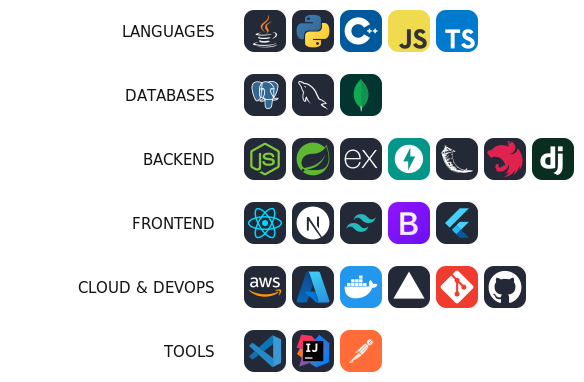

# KEVIN MENDOZA CHAMORRO

### SOFTWARE ENGINEER

 

<picture>
  <source media="(prefers-color-scheme: dark)" srcset="assets/typing-dark.svg">
  
</picture>

 
 

&nbsp;

&nbsp;

 

## About Me

Software Engineering student at **Universidad Nacional Mayor de San Marcos (UNMSM)**, focused on building software that lasts. I design and build complete systems — from clean, well-structured APIs to the architecture that holds everything together.

I care about the things that separate code that works from code that scales: **solid architecture, clean code, best practices, and thoughtful design**. I enjoy taking an idea from a blank file to a running system, and lately I've been integrating **AI into real products**, not just demos.

- Building **end-to-end systems**: backend, APIs, databases and the glue between them
- Strong focus on **software architecture & engineering best practices**
- Integrating **AI into real-world solutions**
- Driven by curiosity, discipline and technical excellence

 

## Tech Stack

 

<picture>
  <source media="(prefers-color-scheme: dark)" srcset="assets/stack-v2-dark.svg">
  
</picture>

 

## GitHub Analytics

 

&nbsp;

 
 

 
 

<picture>
  <source media="(prefers-color-scheme: dark)" srcset="https://raw.githubusercontent.com/MARCEKMC/MARCEKMC/output/github-snake-dark.svg">
  
</picture>

